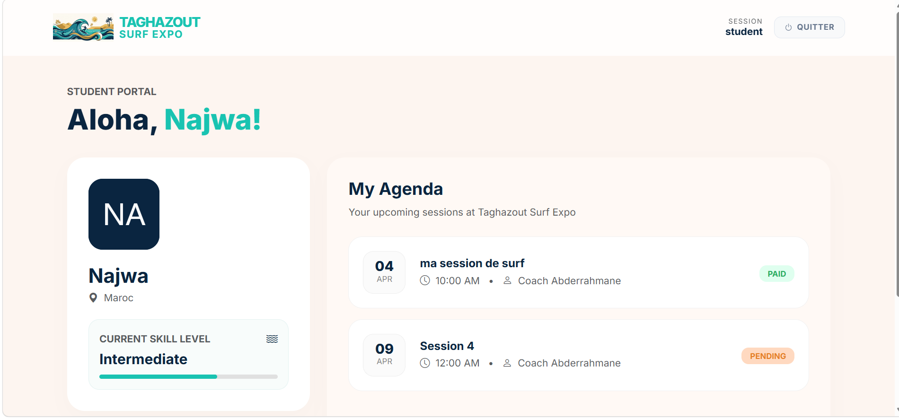

#  Surf Management System



Une plateforme de gestion complète pour une  écoles de surf, permettant le pilotage des sessions, le suivi des élèves et la gestion des paiements.

---

## Aperçu du Projet
Ce projet a été développé en **PHP natif** avec une architecture **MVC** (Modèle-Vue-Contrôleur) robuste, garantissant une séparation claire entre la logique métier, la gestion des données et l'interface utilisateur.

## Fonctionnalités Clés

### Espace Administration (Pilotage Global)
* **Gestion des Sessions :** CRUD complet (Ajout, Modification, Archivage) des cours de surf.
* **Suivi des Élèves :** Liste dynamique avec filtrage par niveau (Débutant, Intermédiaire, Avancé).
* **Gestion des Inscriptions :** Monitoring des présences et statut des paiements (Payé/En attente).
* **Tableau de bord :** Vue d'ensemble des revenus et du taux d'occupation des sessions.

### Espace Élève
* **Profil Personnel :** Suivi de la progression et du niveau.
* **Inscriptions :** Consultation et inscription aux sessions de surf disponibles.
* **Historique :** Accès aux sessions passées et à venir.

### Sécurité & Authentification
* Système de login sécurisé avec gestion des rôles (**Admin** vs **Student**).
* Contrôle d'accès aux routes (Routage centralisé via `index.php`).

## Stack Technique
* **Backend :** PHP 8.x (POO avec Héritage), MySQL (PDO).
* **Frontend :** Bootstrap 5 (Responsive Design), Bootstrap Icons.
* **Architecture :** MVC avec Front Controller et Autoloading (PSR-4).
* **Outils :** Git, XAMPP, VS Code.

## Structure du Projet
```text
├── assets/             # Images (logo)
├── Controllers/        # Logique de contrôle (AuthController, AdminController, etc.)
├── Database/           # Connexion PDO et configuration BDD
├── Models/             # Classes de données et logique métier (Admin, Student, User)
├── Views/              # Templates de l'interface utilisateur
│   ├── admin/          # Pages de gestion (Dashboard, Inscriptions, Sessions)
│   ├── auth/           # Pages de connexion et d'inscription
│   ├── includes/       # Composants réutilisables (Header, Footer)
│   └── student/        # Espace personnel de l'élève
└── index.php           # Front Controller (Point d'entrée unique & Routage)
```
## Installation

### 1. Cloner le dépôt
```bash
git clone https://github.com/touria-rmouque/Simplon-Bootcamp/tree/main/PixelCraft_SurfProject
```
### 2. Base de données

Importer le fichier `database.sql` dans votre serveur MySQL via **phpMyAdmin**.

### 3. Configuration

Modifier les accès à la base de données dans le fichier :

`/Database.php`

### 4. Lancement

- Placer le dossier du projet dans `htdocs` (XAMPP)
- Ouvrir votre navigateur et accéder à :

`http://localhost/Surf_Management`