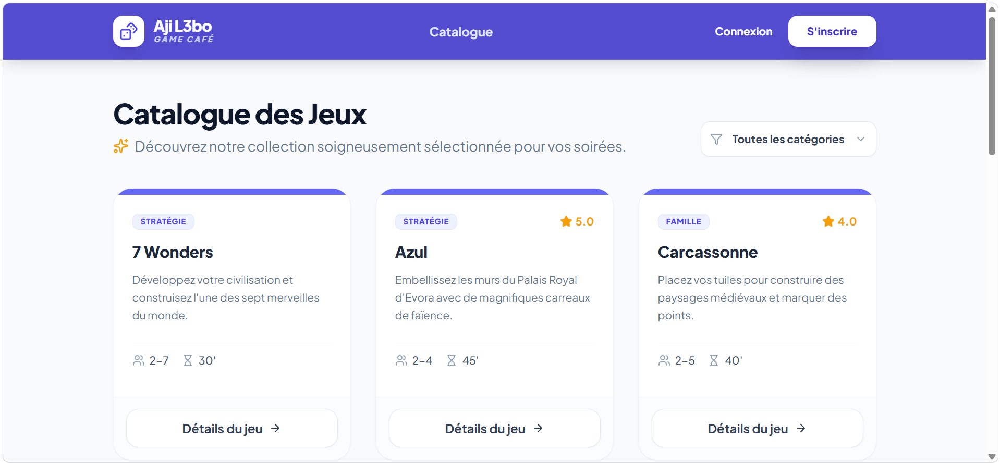

# Game Booking & Rating System



Une application web complète de gestion pour un café de jeux de société, permettant la réservation de tables, la consultation d'un catalogue de jeux et la gestion des avis clients.

## Description du projet
Ce projet est une plateforme interactive développée en **PHP (Architecture MVC)**. Elle permet aux utilisateurs de découvrir des jeux de société, de réserver des sessions de jeu et de partager leur expérience via un système de notation. L'administration dispose d'un tableau de bord pour gérer le catalogue et suivre les sessions en temps réel.

## Suivi du projet (Jira)
Voici l'état final de notre tableau de bord de gestion de projet reflétant le cycle de développement agile :

![Board Jira Final] 

## Arborescence de l'architecture
Le projet suit une structure **Modèle-Vue-Contrôleur (MVC)** pour une séparation claire des responsabilités :

```text
/
├── public/                # Point d'entrée (index.php, Assets CSS/JS)
├── src/
│   ├── Controllers/       # Logique métier (GameController, AuthController)
│   ├── Models/            # Interaction DB (Game.php, Rating.php, User.php)
│   ├── Core/              # Cœur du système (Router.php, Database.php)
│   └── Services/          # Services auxiliaires (AuthService, Mailer)
├── views/                 # Templates d'affichage (Layout, Partials)
├── vendor/                # Dépendances gérées par Composer
├── composer.json          # Liste des packages et autoloading
└── database.sql           # Schéma de la base de données MySQL
```
## Installation

### 1. Cloner le dépôt
```bash
git clone https://github.com/touria-rmouque/Simplon-Bootcamp/tree/main/gamecafe
```
### 2. Base de données

Importer le fichier `database.sql` dans votre serveur MySQL via **phpMyAdmin**.

###  4. Lancement

```bash
php -S localhost:8000 -t public
```