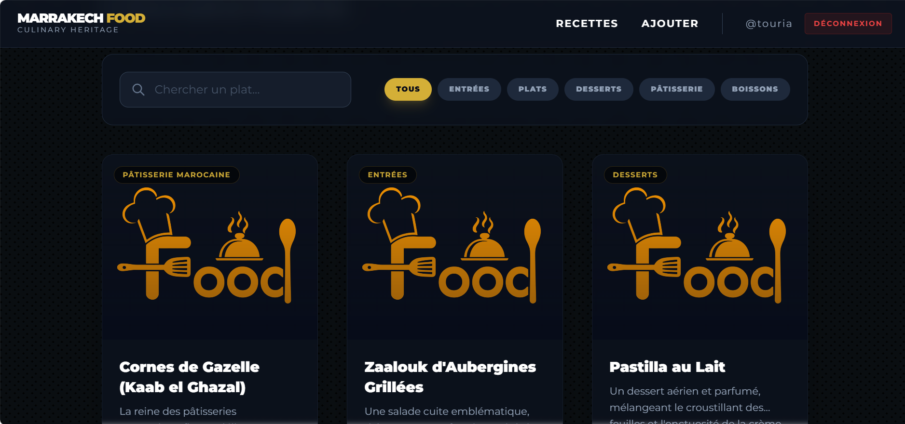
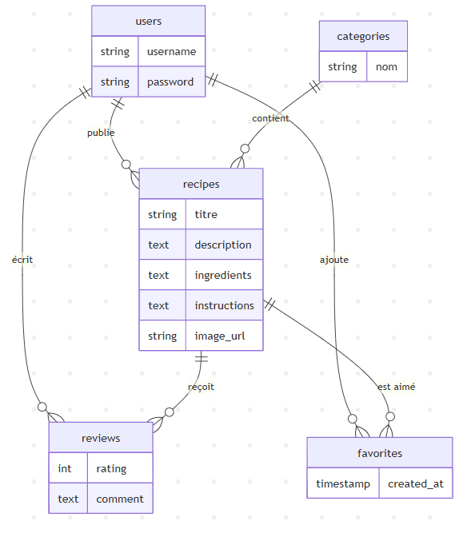
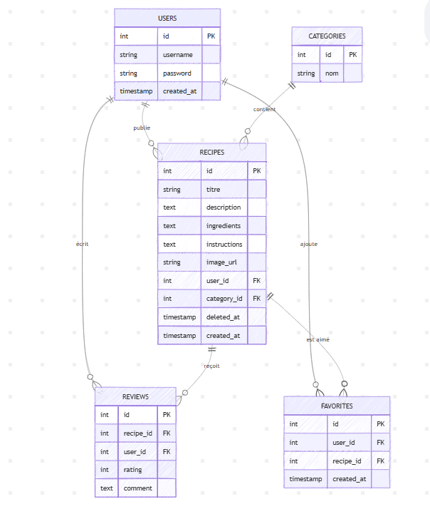

# Marrakech Food Lovers 



Bienvenue sur le projet **Marrakech Food Lovers**, une application web dynamique dédiée à la découverte et au partage de recettes traditionnelles marocaines. Ce projet a été réalisé dans le cadre du **Simplon Bootcamp**.

---

## Présentation du Projet

L'objectif de cette application est d'offrir une plateforme intuitive où les utilisateurs peuvent explorer des recettes (Tanjia, Couscous, etc.), les enregistrer en favoris et partager leurs avis.

### Fonctionnalités clés :
- **Système d'Authentification** : Inscription et connexion sécurisée des utilisateurs.
- **Gestion des Recettes** : CRUD complet (Création, Lecture, Mise à jour, Suppression).
- **Favoris** : Possibilité d'ajouter des recettes à ses coups de cœur.
- **Avis & Commentaires** : Système de notation et de commentaires pour chaque plat.
- **Recherche & Filtres** : Recherche par mots-clés et filtrage par catégories de plats.
- **Sécurité (Soft Delete)** : Suppression logique des recettes pour préserver l'intégrité des données.

---

## Architecture & Technologies

### Stack Technique :
- **Backend** : PHP Natif (Architecture MVC).
- **Frontend** : Tailwind CSS, JavaScript (Vanilla).
- **Base de Données** : MySQL.
- **Gestion de version** : Git / GitHub avec méthodologie Git Flow.

### Modélisation de la base de données (MCD) :

### Modélisation de la base de données (MLD) :


### Structure du Projet
```text
marrakech_food/
├── assets/             # Fichiers statiques (images, schémas)
│   ├── diagrame/       # Schémas MCD et MLD
│   └── img/            # Images des recettes
├── Controllers/        # Logique de traitement des requêtes
├── Models/             # Interactions avec la base de données
├── Services/           # Classes utilitaires et sécurité
├── Views/              # Templates et affichage
│   ├── auth/           # Connexion et inscription
│   ├── layout/         # Header, Footer, Navigation
│   └── recipes/        # Gestion des recettes
├── .htaccess           # Gestion du routage des URLs
├── config.php          # Configuration de la base de données
├── index.php           # Point d'entrée de l'application
└── README.md           # Documentation
```
## Installation

### 1. Cloner le dépôt
```bash
git clone https://github.com/touria-rmouque/Simplon-Bootcamp/tree/main/marrakech_food
```
### 2. Base de données

Importer le fichier `database.sql` dans votre serveur MySQL via **phpMyAdmin**.

### 3. Configuration

Ajustez vos accès (hôte, utilisateur, mot de passe) dans config.php.

### 4. Lancement

- Placer le dossier du projet dans `htdocs` (XAMPP)
- Ouvrir votre navigateur et accéder à :

`http://localhost/marrakech_food/`