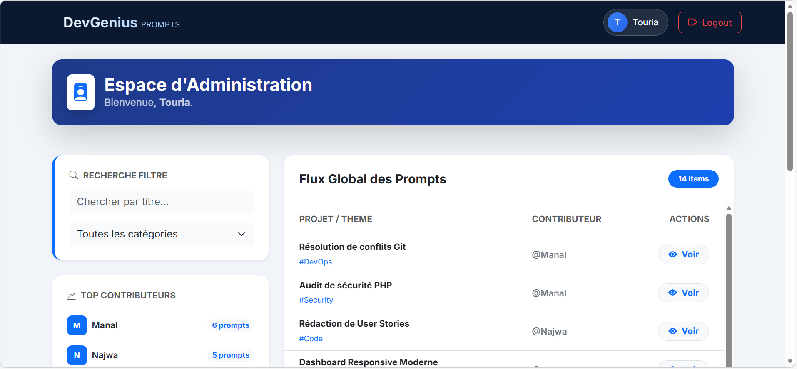

# Prompt-Repo : Système de Gestion de Prompts (MVC)

**Prompt-Repo** est une plateforme centralisée permettant aux développeurs de stocker, modifier et partager leurs meilleurs prompts d'IA. Ce projet met en œuvre une architecture **MVC personnalisée** en PHP natif pour garantir une séparation claire entre la logique métier et l'interface utilisateur.

---

## Aperçu du Projet



## Technologies Utilisées

### **Backend**
* **PHP 8.5 :** Utilisation de la programmation orientée objet (POO).
* **MySQL & PDO :** Gestion de la base de données avec requêtes préparées (anti-injection SQL).
* **Architecture MVC :** Moteur "maison" (Models, Views, Controllers) construit de zéro.

### **Frontend**
* **Bootstrap 5 :** Design moderne, épuré et totalement responsive.
* **SweetAlert2 :** Notifications "Toast" fluides et boîtes de dialogue de confirmation.
* **JavaScript :** Système de filtrage instantané sans rechargement de page.

---

## Structure du Projet

```text
prompt-repo/
├── config/             # Connexion DB (Database.php) et scripts SQL
├── controllers/        # Logique des actions (Auth, Prompts, Categories)
├── models/             # Classes d'accès aux données (SQL)
├── public/             # Assets statiques (JS, CSS, Images)
├── views/              # Fichiers d'affichage (HTML/PHP)
│   └── partials/       # Composants réutilisables (header, footer)
├── .htaccess           # Configuration du point d'entrée
└── index.php           # Redirection automatique
```

## Instructions d'Installation

Suivez ces étapes pour déployer le projet sur votre environnement local (XAMPP / WAMP) :

---

## 1. Clonage du dépôt

Placez-vous dans votre dossier `htdocs` et exécutez :

```bash
git clone https://github.com/touria-rmouque/prompt-repo.git

## 2. Importation de la Base de Données

- Lancez **Apache** et **MySQL** via XAMPP  
- Accédez à : http://localhost/phpmyadmin/  
- Créez une base de données nommée : `prompt_db`  
- Importez le fichier : `config/db.sql` situé dans le dossier du projet  

## 3. Configuration

Vérifiez les accès dans le fichier `config/Database.php` :

```php
private $host = "localhost";
private $db_name = "prompt_db";
private $username = "root"; 
private $password = ""; 

## 4. Lancement

Ouvrez votre navigateur et accédez à :
[text](http://localhost/prompt-repo/)